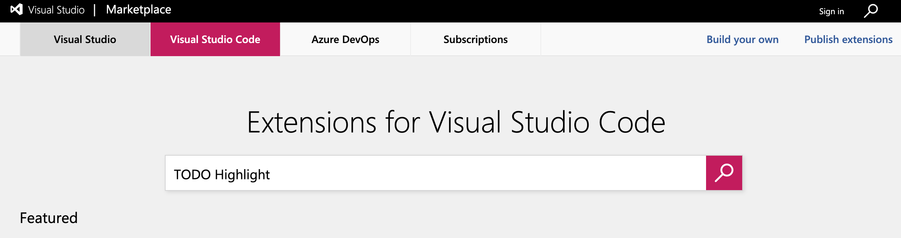
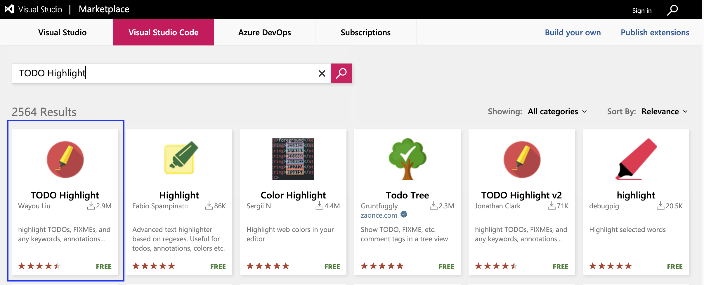
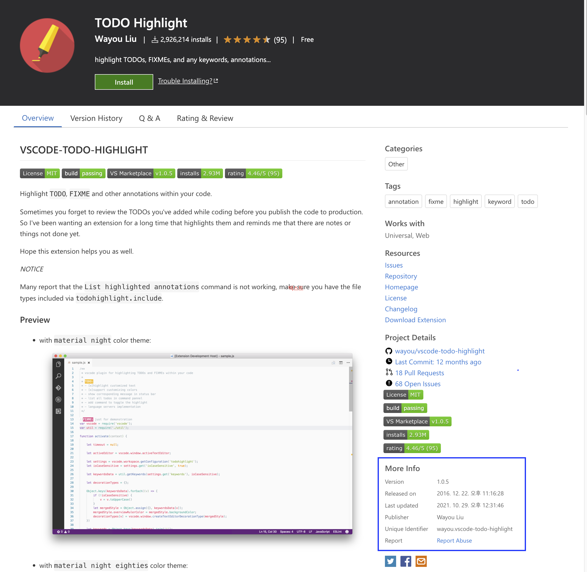
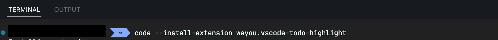

# vscode-extension-install-automation

> (02/07) 더 간단한 방법은 https://github.com/mugglim/config/tree/main/vscode/extensions 링크를 참고해주세요!

Visual Studio Code Extension의 설치 과정을 CLI 환경에서 자동화해주는 방법을 설명합니다.
(단, 본인의 환경에서 Visual Studio Code가 설치 되어 있어야 합니다.)

## Run with npm script

```bash
# with shell script
npm run setup:shell-script

# with node.js
npm run setup:node
```

## How to setup?

## CLI 환경에서 Extension 설치하기

> VSCode는 CLI 환경에서 Extension을 제거 및 삭제 할 수 있는 방법을 제공하고 있습니다.
> ⇒ **[Command line extension management](https://code.visualstudio.com/docs/editor/extension-marketplace#_command-line-extension-management)**

CLI 환경에서 Extension을 제어하기 위해서는 Extension의 Unique Identifier이 필요합니다. Unique Identifier은 VSCode의 [Marketplace](https://marketplace.visualstudio.com/)에서 Extension을 검색 후 More Info 섹션에서 확인 가능합니다.

```bash
code --install-extension {Unique Identifier}
```

### 예제 : TODO Highlight을 CLI 환경에서 설치해보기

### **1. MarketPlace에서 [TODO Highlight](https://marketplace.visualstudio.com/items?itemName=wayou.vscode-todo-highlight) 검색**



### **2. Unique Identifier 확인**

- TODO Highlight Extension의 Unique Identifier는 **wayou.vscode-todo-highlight**입니다.
  (기준 : 2022.10.22)




### **3. TODO Highlight CLI로 설치**

```bash
code --install-extension wayou.vscode-todo-highlight
```



### **4. VSCode 재실행**

## Shell script로 Extension 설치 자동화하기

프로젝트를 세팅하다 보면, 종종 Extension도 설치하는 경우가 있습니다. 이 과정을 Shell scrip로 자동화해보겠습니다.

### 예제: ESLint, Prettier, TODO Highlight Shell script로 설치하기

우선, 각 Extension의 Unique Identifier을 `vscode-extension.text`에 작성해주세요. 각 Extension의 Unique Identifier은 아래와 같습니다.

- ESLInt : dbaeumer.vscode-eslint
- Prettier : esbenp.prettier-vscode
- TODO Highlight : wayou.vscode-todo-highlight

### 1. `vscode-extension.text` 작성

```
dbaeumer.vscode-eslint
esbenp.prettier-vscode
wayou.vscode-todo-highlight
```

### 2. `vscode-auto-install.sh` 작성

```bash
#!/bin/bash

BASE_DIR=$(dirname "$0")
EXTENSION_IDENTIFIERS=$(cat "${BASE_DIR}/vscode-extension.txt")

for identifier in $EXTENSION_IDENTIFIERS
do
    echo $(code --install-extension $identifier)
done
```

### 3. `vscode-auto-install.sh` 실행

```bash
sh ./vscode-auto-install.sh
```

- (참고) zsh을 사용하는 경우 chmod를 통해 스크립트 파일의 쓰기 권한을 부여 후 진행해주세요

```bash
chmod +x [vscode-auto-install.sh](http://vscode-auto-install.sh)
```

## (추가) Node.js로 Extension 설치 자동화하기

### 1. `vscode-extension.json` 작성

```json
{
  "eslint": "dbaeumer.vscode-eslint",
  "prettier": "esbenp.prettier-vscode",
  "todo-highlight": "wayou.vscode-todo-highlight"
}
```

### 2. `vscode-auto-install.js` 작성

```tsx
const {exec} = require('child_process');
const ExtensionIdentifiers = require('./vscode-extension.json');

const VSCODE_INSTALL_EXTENSION_SCRIPT = 'code --install-extension';

for (const [extension, identifier] of Object.entries(ExtensionIdentifiers)) {
  exec(`${VSCODE_INSTALL_EXTENSION_SCRIPT} ${identifier}`, (err, stdout) => {
    if (err) {
      console.log(err);
    }

    console.log(`🚀 ${extension} 🚀`);
    console.log(stdout);
  });
}
```

### 3. `vscode-auto-install.js` 실행

```bash
node vscode-auto-install.js
```
